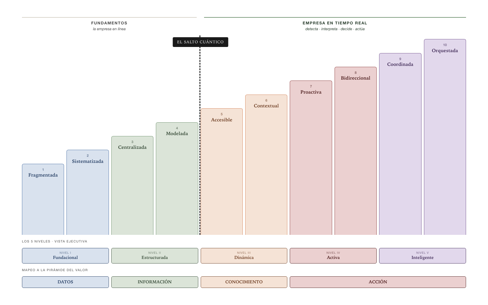

# IRIS — Modelo de Madurez de Inteligencia Organizacional

*En la era de la IA agentiva*

## Introducción · La Tesis

<!-- libro
Con el mapa general trazado en la Introducción — la inversión del flujo ("la inteligencia va hacia las personas"), los tres ejes de cambio y El Salto Cuántico — este capítulo desciende al primer eje del camino: cómo se mide, etapa por etapa, la inteligencia organizacional. IRIS modela esa trayectoria completa, de la información fragmentada al ecosistema que se auto-gestiona.
/libro -->

<!-- standalone -->
Durante 30 años, el paradigma de gestión de información fue **"personas van hacia los datos"**: construyes un warehouse, montas dashboards, entrenas usuarios, y esperas que alguien mire el reporte correcto en el momento correcto y tome la decisión correcta. Todo el modelo descansa sobre la atención humana como cuello de botella.

La inteligencia artificial está cambiando esa ecuación, pero no toda la IA la cambia de la misma manera. La industria distingue entre dos horizontes. En el mundo *agéntico* (agentic), los agentes complementan las aplicaciones existentes: los empleados siguen abriendo Excel, Salesforce, Power BI — ahora con copilotos que los ayudan a trabajar más rápido. Es evolución incremental. En el mundo **agentivo**, los agentes reemplazan las interfaces tradicionales: los empleados dejan de abrir aplicaciones e interactúan directamente con agentes que ejecutan tareas en su nombre. Las aplicaciones pueden seguir existiendo como infraestructura, pero la interfaz ha colapsado. Es transformación fundamental. La frontera entre ambos mundos — ¿sus empleados todavía abren aplicaciones para hacer su trabajo? — es lo que llamamos **La Línea Nadella**.

**¿Por qué "agentiva" y no "agéntica"?** Porque no son lo mismo. La industria ha adoptado "agentic AI" para describir agentes que asisten — copilotos, asistentes, herramientas más inteligentes. Pero este modelo mide la trayectoria hacia algo cualitativamente diferente: un mundo donde los agentes no complementan la forma de trabajar sino que la transforman. Usar "agéntica" posicionaría este modelo en el horizonte de la evolución incremental. Usar "agentiva" lo posiciona en el horizonte de la transformación fundamental — que es lo que las etapas avanzadas del modelo describen.

La IA agentiva invierte el flujo de información: **"la inteligencia va hacia las personas — y actúa en su nombre."** Un sistema de agentes monitorea, interpreta, decide y ejecuta dentro de los límites que la organización ha definido, y escala al humano solo cuando corresponde. Este cambio no es una mejora incremental al stack de analytics — es un cambio de modelo operativo.

El impacto se manifiesta en tres ejes simultáneos:

**De consumir información a gobernar agentes.** Las personas dejan de ser consumidoras de dashboards para convertirse en diseñadoras de reglas y supervisoras de sistemas autónomos. El CFO no revisa un dashboard de cashflow — define los umbrales y protocolos que un agente financiero ejecuta autónomamente.

**De arquitectura para humanos a arquitectura para agentes.** Los data warehouses optimizados para SQL dan paso a capas semánticas donde agentes razonan, knowledge graphs para inferencia autónoma, y flujos de datos en tiempo real. La calidad de dato deja de medirse por "limpieza" y se mide por "accionabilidad."

**De gobernanza de acceso a gobernanza de autonomía.** La pregunta ya no es "quién puede ver qué datos" sino "qué puede hacer un agente, bajo qué condiciones, y con qué trazabilidad." Las organizaciones que no resuelvan esto no podrán escalar agentes más allá de pilotos aislados.

La trayectoria de esta transformación se articula a través de la **Pirámide del Valor**: desde organizaciones enfocadas en la capa de DATOS (acumular y estructurar), pasando por INFORMACIÓN (contextualizar), luego CONOCIMIENTO (analizar y comprender en tiempo real), hasta ACCIÓN (ejecutar autónomamente dentro de marcos gobernados). El momento más disruptivo ocurre cuando el costo de una pregunta analítica colapsa de semanas a segundos — lo que llamamos **El Salto Cuántico** — habilitando que la organización pase de racionar sus preguntas a tener capacidad analítica elástica e ilimitada.
<!-- /standalone -->

### ¿Por qué "inteligencia organizacional" y no "gestión de información"?

Existen modelos de madurez de gestión de información bien establecidos en la industria. Miden aspectos críticos — calidad de datos, gobernanza, arquitectura, integración — pero se concentran en las dos primeras capas de la Pirámide del Valor: DATOS e INFORMACIÓN. Este modelo abarca las cuatro capas, desde datos fragmentados hasta acción autónoma orquestada. Eso ya no es gestión de información — es la capacidad de una organización de transformar datos en inteligencia accionable.

Por eso hablamos de **inteligencia organizacional**: no se trata de qué tan bien gestionas tus datos, sino de qué tan capaz es tu organización de generar conocimiento y actuar sobre él de forma continua y autónoma. La gestión de información es el cimiento necesario — pero no el destino.

### Empresa en Línea vs. Empresa en Tiempo Real

<!-- standalone -->
La distinción entre *acceder* a información en tiempo real y *reaccionar* en tiempo real es central para entender la trayectoria que este modelo mide.

Una **empresa en línea** tiene sus datos actualizados, sus dashboards al día, su información accesible — pero depende de que un humano mire, interprete y decida. Una **empresa en tiempo real** no solo accede: detecta, interpreta, decide y actúa — de forma continua y autónoma.
<!-- /standalone -->
<!-- libro
Recordando la distinción que la Introducción estableció — la empresa en línea accede; la empresa en tiempo real actúa — el modelo la operacionaliza así:
/libro -->

Las etapas 1–4 del modelo construyen los **fundamentos**: desde datos fragmentados hasta un modelo semántico gobernado. La Etapa 4 (Modelada) completa la infraestructura de datos — integración, definiciones compartidas, gobernanza formal — pero la explotación analítica sigue dependiendo de intermediarios técnicos.

Las etapas 5–10 construyen la **empresa en tiempo real**: desde acceso democrático sin intermediarios, pasando por información contextual y proactiva, sistemas que anticipan y actúan, hasta un ecosistema de inteligencia auto-gestionado. La Etapa 5 (Accesible) es donde el paradigma cambia — cualquier persona obtiene respuestas sin intermediarios — y la Etapa 10 (Orquestada) representa la empresa en tiempo real plena.

**El Salto Cuántico** (salto 4→5) es la frontera entre ambos mundos. Y La Línea Nadella se mapea naturalmente: los fundamentos (1–4) son inherentemente agénticos — mejores herramientas para los mismos procesos. A partir de la Etapa 5, la trayectoria cruza progresivamente hacia lo agentivo — los procesos mismos se transforman.

### La convergencia

Este modelo mide la trayectoria de una organización desde datos fragmentados hasta inteligencia organizacional plena, donde tres conceptos convergen:

**Inteligencia Organizacional** es la capacidad que se mide — el *qué*.
**Empresa en Tiempo Real** es el resultado organizacional de esa capacidad madura — el *para qué*.
**IA Agentiva** es el mecanismo habilitador que hace posible la transformación — el *cómo*.

<!-- standalone -->
> La visión completa, incluyendo los datos de contexto de la industria y las 30+ fuentes públicas que la respaldan, se encuentra en el documento complementario: *Visión de AURA — Arquitectura Unificada de Referencia Agentiva* (ultraBASE, Febrero 2026).
<!-- /standalone -->
<!-- libro
> Los datos de contexto de la industria y las fuentes públicas que respaldan esta visión están en la Introducción de este libro.
/libro -->

### IRIS y MOTOR: el par diagnóstico de AURA

IRIS es uno de dos modelos complementarios dentro de **AURA** (Arquitectura Unificada de Referencia Agentiva). Junto con **MOTOR** (Modelo de Madurez de Automatización Organizacional), conforman el diagnóstico completo de la transformación organizacional:

**IRIS** mide qué tan bien fluye la información — desde datos fragmentados hasta un ecosistema de inteligencia auto-gestionado. **MOTOR** mide qué tan automatizados están los procesos — desde uso ad-hoc de IA hasta ejecución autónoma orquestada.

Son ortogonales: una organización puede estar alta en uno y baja en el otro. La madurez organizacional plena requiere avanzar en ambos ejes.

### Naturaleza diagnóstica

IRIS es un modelo **diagnóstico**. Su propósito es evaluar en qué etapa se encuentra una organización y qué significa esa etapa — no prescribir qué implementar, cuánto invertir ni en qué plazo. La prescripción corresponde a la consultoría especializada que se construye sobre el diagnóstico.

Esta decisión de diseño es intencional: el estado del arte en IA evoluciona a velocidad sin precedente. Un modelo que prescriba tecnologías específicas queda obsoleto en meses. Un modelo que diagnostique estados de madurez permanece válido porque mide capacidades organizacionales, no herramientas.

<!-- pagebreak -->
## Estructura del Modelo

El modelo evalúa la madurez de inteligencia organizacional a través de **10 etapas** que representan estadios progresivos en la capacidad de la organización de transformar datos en acción.

Las etapas 1–4 construyen los **fundamentos** (empresa en línea); las etapas 5–10 construyen la **empresa en tiempo real**. Las 10 etapas se agrupan en **5 niveles** que ofrecen una vista simplificada para comunicación ejecutiva.

### Principios de diseño

**Foco en inteligencia organizacional, no en adopción de IA.** Cada etapa se define por la capacidad de la organización de transformar datos en acción — cómo se captura, estructura, accede, contextualiza, distribuye y actúa sobre la información. La IA agentiva aparece como el mecanismo habilitador, no como el objeto de medición.

**Coexistencia evolutiva.** Cada etapa subsume a la anterior, no la reemplaza. Una organización en Etapa 8 no elimina su data warehouse — lo integra en un sistema donde la información fluye proactivamente. La infraestructura de etapas anteriores se convierte en cimiento, no en legado.

**Progresión gradual.** Las transiciones entre etapas representan saltos de magnitud razonablemente equivalente. Esto permite a la organización planificar avances realistas y medir progreso de forma proporcional.

<!-- pagebreak -->

## Etapa 1 · Fragmentada
### La información existe dispersa sin conexión entre sistemas

**Flujo de información:** Los datos existen dispersos en múltiples sistemas sin conexión entre sí.

La organización opera con islas de información. Cada departamento, sistema o proceso genera datos que viven en su propio silo — ERPs, hojas de cálculo, archivos compartidos, sistemas legados, bases de datos departamentales. No hay un inventario de qué datos existen, dónde residen, ni quién es responsable de ellos.

Cuando alguien necesita información para tomar una decisión, el proceso es manual y ad-hoc: buscar en correos, pedir archivos a colegas, consolidar datos en Excel, corregir inconsistencias a mano. El mismo dato puede existir en tres versiones diferentes sin que nadie sepa cuál es correcta. Los reportes se construyen desde cero cada vez que se necesitan.

El valor se concentra en la capa de **DATOS** de la Pirámide del Valor.

**Características observables:**

- No existe un repositorio central de datos ni catálogo de fuentes
- Los reportes se construyen manualmente desde múltiples fuentes desconectadas
- Inconsistencias frecuentes entre datos de distintas áreas (números que no cuadran entre finanzas y operaciones)
- La "fuente de verdad" depende de a quién se le pregunte
- No hay roles definidos para gestión de datos
- Decisiones basadas en intuición, experiencia o datos anecdóticos

**Pregunta diagnóstica:** *¿Si le pido a dos personas de áreas diferentes el mismo indicador, obtendré el mismo número?*

<!-- pagebreak -->
## Etapa 2 · Sistematizada
### Los datos se capturan de forma ordenada en sistemas definidos

**Flujo de información:** Los datos se capturan de forma ordenada en sistemas definidos, aunque la analítica sigue siendo manual.

La organización ha dado el primer paso estructural: existe consciencia de que los datos son un activo y se han implementado sistemas para capturarlos de forma consistente. Hay un ERP o sistema transaccional que funciona como columna vertebral, los procesos de registro están estandarizados, y existen reglas básicas de integridad de datos.

La diferencia con la etapa anterior no es tecnológica sino organizacional: alguien se ha preguntado "¿cómo deberíamos capturar esto?" en lugar de simplemente dejar que los datos se acumulen. Sin embargo, la explotación de esos datos sigue siendo manual — extracciones ad-hoc, reportes en Excel, consolidaciones periódicas.

**Salto 1→2:** La organización pasa de acumular datos como subproducto a capturarlos con intención y disciplina.

**Características observables:**

- Sistemas transaccionales estandarizados (ERP, CRM) con procesos de registro definidos
- Reglas básicas de integridad de datos (campos obligatorios, validaciones)
- Procesos de extracción de datos identificados, aunque manuales o semi-automáticos
- Responsables de datos asignados al menos informalmente
- Reportes periódicos generados manualmente pero con fuentes identificadas
- Los datos son confiables dentro de cada sistema, aunque cruzar sistemas sigue siendo difícil

**Pregunta diagnóstica:** *¿Hay un sistema definido para capturar las transacciones clave del negocio, con reglas de registro consistentes?*

<!-- pagebreak -->
## Etapa 3 · Centralizada
### Los datos se consolidan en un repositorio central con BI formal

**Flujo de información:** Los datos se consolidan en un repositorio central y se generan reportes estandarizados.

La organización ha implementado un data warehouse o repositorio central que consolida datos de múltiples fuentes. Existen procesos ETL (Extract-Transform-Load) que alimentan este repositorio de forma regular. Se han construido dashboards y reportes estandarizados que ofrecen una visión unificada del negocio.

Este es el modelo clásico de Business Intelligence: un equipo técnico construye y mantiene la infraestructura analítica, y los usuarios de negocio consumen los reportes y dashboards predefinidos. El flujo es unidireccional — datos entran, reportes salen — y la capacidad analítica está limitada a lo que se ha pre-construido.

El valor se concentra en la capa de **INFORMACIÓN** de la Pirámide del Valor — datos con contexto, estructura y propósito.

**Salto 2→3 · Frontera de nivel (Fundacional → Estructurada):** La organización pasa de *tener datos* a *usar datos para entender el negocio*. Requiere inversión en infraestructura analítica y en la disciplina organizacional para mantenerla.

**Características observables:**

- Data warehouse o repositorio central implementado
- Procesos ETL automatizados que consolidan datos periódicamente
- Dashboards y reportes estandarizados en una herramienta de BI (Power BI, Tableau, etc.)
- Equipo de BI/datos dedicado que construye y mantiene la infraestructura
- KPIs definidos y visibles para la organización
- Los usuarios acceden a información pre-construida — si no está en un dashboard, no existe

**Pregunta diagnóstica:** *¿Existe un data warehouse centralizado con dashboards que los usuarios de negocio consultan regularmente?*

<!-- pagebreak -->
## Etapa 4 · Modelada
### Los datos están organizados con definiciones semánticas de negocio

**Flujo de información:** Los datos están organizados en modelos semánticos con definiciones de negocio compartidas.

La organización ha ido más allá de simplemente centralizar datos: los ha modelado. Existe un modelo dimensional o semántico que traduce los datos técnicos a conceptos de negocio — "revenue" no es un campo en una tabla sino un concepto definido con reglas claras de cálculo, granularidad y contexto. Las métricas tienen definiciones únicas y compartidas por toda la organización.

La diferencia clave con la etapa anterior es la presencia de una **capa semántica** — formal o informal — que separa el "qué significan los datos" del "dónde están los datos." Esto habilita análisis más sofisticados: análisis dimensionales, drill-downs, análisis comparativos, y cierta capacidad de self-service para usuarios avanzados.

**Salto 3→4:** La organización pasa de centralizar datos a darles significado compartido.

**Características observables:**

- Modelo de datos dimensional o semántico documentado
- Definiciones de métricas y KPIs compartidas y gobernadas (catálogo de métricas)
- Capacidad de drill-down y análisis dimensional
- Cierto nivel de self-service para usuarios de negocio avanzados
- Gobierno de datos formalizado con ownership de métricas
- Procesos de data quality identificados y monitoreados
- Usuarios de negocio pueden hacer preguntas dentro del universo modelado, aunque no fuera de él

**Pregunta diagnóstica:** *¿Las métricas clave del negocio tienen una definición única y gobernada que toda la organización comparte?*

<!-- pagebreak -->
## Etapa 5 · Accesible
### Cualquier persona accede a la información sin intermediarios técnicos

**Flujo de información:** Cualquier persona puede obtener respuestas de los datos sin depender de intermediarios técnicos.

La organización ha democratizado el acceso a la información. No se necesita un analista o un equipo de BI para responder una pregunta de negocio — los usuarios pueden consultar directamente, ya sea a través de interfaces conversacionales, herramientas de analytics aumentado, o búsqueda semántica sobre los datos.

Lo que antes tomaba una semana (coordinar con el equipo de BI, levantar requerimientos, esperar el desarrollo, validar resultados) ahora toma minutos. El cuello de botella de la intermediación humana desaparece. Esto no significa que el equipo de datos desaparezca — se transforma: de constructor de reportes a curador de la capa semántica y guardián de la calidad de los datos que los sistemas consumen.

La Etapa 5 es el primer estado de la **empresa en tiempo real**: toda la información está disponible, el acceso es democrático, la organización puede responder cualquier pregunta en minutos. El paradigma ha cambiado — la infraestructura de fundamentos está resuelta y la organización opera en un modelo cualitativamente distinto — aunque la reacción autónoma aún no ha comenzado.

El valor se concentra en la capa de **CONOCIMIENTO** de la Pirámide del Valor — comprensión, patrones, análisis en tiempo real.

**Salto 4→5 · Frontera de nivel (Estructurada → Dinámica) — El Salto Cuántico:** Este es el salto más transformador del modelo. Representa la transición de un paradigma donde la información solo existe si alguien la pre-construyó a un paradigma donde se genera en tiempo real a partir de la necesidad. Es el punto donde el costo de una pregunta analítica colapsa de semanas a segundos. Esta es la frontera entre los **fundamentos** (empresa en línea) y la **empresa en tiempo real** — donde la IA agentiva habilita un cambio cualitativo en la relación entre la organización y su información.

**Características observables:**

- Interfaces de acceso a datos conversacionales o de lenguaje natural
- Los usuarios de negocio obtienen respuestas sin escribir SQL ni esperar a un analista
- La capa semántica permite que sistemas inteligentes interpreten las preguntas con precisión
- El equipo de datos se enfoca en curar datos y modelos, no en construir reportes
- El volumen de preguntas analíticas aumenta significativamente (preguntas que antes nadie hacía, ahora se hacen)
- Coexistencia con dashboards para monitoreo continuo de KPIs

**Pregunta diagnóstica:** *¿Un gerente puede obtener una respuesta analítica que no estaba pre-construida en un dashboard, en minutos en lugar de semanas?*

<!-- pagebreak -->
## Etapa 6 · Contextual
### La información se adapta al contexto y enriquece respuestas

**Flujo de información:** La información se adapta al contexto y fluye de forma diferente según quién la necesita, cuándo y para qué.

La Etapa 6 profundiza la empresa en tiempo real: ya no se trata solo de que la información esté disponible, sino de que el sistema *entienda* lo que la información significa en cada contexto.

Más allá de solo responder preguntas, la información se vuelve contextual y adaptativa. El mismo dato se presenta de forma diferente según el rol, el momento del ciclo de negocio, o la decisión que se está tomando. Los análisis no son estáticos — evolucionan, incorporan nuevas fuentes, y se ajustan a las necesidades cambiantes.

La diferencia con la etapa anterior es que la información ya no solo "está disponible" — está **viva**. Se cruzan fuentes, se detectan patrones, se generan análisis que nadie pidió explícitamente pero que son relevantes. El sistema no solo responde preguntas sino que las enriquece con contexto.

**Salto 5→6:** La organización pasa de responder preguntas a entregar información contextual y viva. El sistema comienza a *comprender*, no solo a *mostrar*.

**Características observables:**

- Análisis contextualizado según rol, momento y necesidad
- Cruce automático de fuentes de datos para enriquecer respuestas
- Capacidad de iterar y profundizar en cadenas de preguntas complejas
- Detección de patrones y anomalías como parte del flujo analítico
- La información se presenta de forma diferente a un CFO que a un gerente de operaciones, aún cuando la pregunta sea similar
- Análisis ad-hoc tan confiables como los reportes pre-construidos

**Pregunta diagnóstica:** *¿El sistema es capaz de cruzar fuentes y enriquecer una respuesta con contexto relevante que el usuario no pidió explícitamente?*

<!-- pagebreak -->
## Etapa 7 · Proactiva
### La información anticipa necesidades y busca al usuario

**Flujo de información:** La información anticipa necesidades, alerta sobre situaciones relevantes, y llega a las personas correctas sin que la pidan.

La organización no espera a que alguien pregunte. Los sistemas monitorean continuamente, detectan situaciones que requieren atención, y entregan la información relevante a quien corresponde antes de que la soliciten. Un agente detecta que un indicador cruzó un umbral, analiza la causa probable, y notifica al responsable con el contexto necesario para decidir.

El cambio fundamental es la dirección del flujo: de pull (el usuario busca información) a push (la información busca al usuario). Los humanos siguen siendo quienes deciden y actúan, pero la información llega a ellos de forma proactiva y contextualizada.

El valor se concentra en la capa de **ACCIÓN** de la Pirámide del Valor — la información deja de informar decisiones para desencadenarlas.

**Salto 6→7 · Frontera de nivel (Dinámica → Activa):** La frontera entre organizaciones que usan la información para *entender* y organizaciones donde la información *actúa*. La información no espera a ser consultada — busca a quien la necesita y desencadena acción. La capacidad de reacción autónoma comienza aquí.

**Características observables:**

- Monitoreo continuo de indicadores clave con detección de anomalías
- Alertas inteligentes contextualizadas (no solo "X bajó" sino "X bajó porque Y, y eso afecta Z")
- La información llega al responsable correcto de forma proactiva
- Análisis de causa raíz automatizado que acompaña las alertas
- Reducción del tiempo entre la ocurrencia de un evento y la acción correctiva
- Los dashboards se complementan con flujos de información push personalizados

**Pregunta diagnóstica:** *¿Los responsables de negocio reciben información relevante antes de pedirla, con contexto suficiente para actuar?*

<!-- pagebreak -->
## Etapa 8 · Bidireccional
### La información desencadena acciones autónomas gobernadas

**Flujo de información:** La información no solo llega a las personas — también fluye entre sistemas y desencadena acciones autónomas dentro de límites definidos.

El flujo de información se vuelve bidireccional y operativo. Los agentes no solo alertan — ejecutan acciones predefinidas cuando las condiciones se cumplen. Un agente puede ajustar un parámetro operativo, reclasificar un caso, o disparar un proceso, todo dentro de reglas explícitamente gobernadas. El humano define los umbrales, las reglas y los protocolos de escalamiento; el agente opera dentro de esos límites.

La diferencia con la etapa anterior es que el ciclo Percibir→Interpretar→Decidir→Actuar se completa sin intervención humana en los casos que caen dentro de los parámetros gobernados. El humano supervisa patrones, excepciones y resultados — no cada transacción.

**Salto 7→8:** La organización pasa de información que alerta a información que actúa.

**Características observables:**

- Agentes que ejecutan acciones operativas dentro de parámetros definidos
- Flujos de trabajo automatizados que integran análisis y acción
- Protocolos claros de escalamiento: qué puede decidir el agente vs. qué requiere humano
- Trazabilidad completa de cada decisión autónoma (quién, qué, por qué, cuándo)
- Gobernanza de autonomía: roles definidos para gestionar los límites de los agentes
- Los humanos se enfocan en excepciones, refinamiento de reglas, y supervisión de resultados

**Pregunta diagnóstica:** *¿Existen agentes que ejecutan acciones operativas autónomamente con trazabilidad, dentro de reglas que los humanos definen y supervisan?*

<!-- pagebreak -->
## Etapa 9 · Coordinada
### Agentes y flujos se coordinan entre dominios del negocio

**Flujo de información:** Múltiples agentes y flujos de información se coordinan entre dominios para optimizar resultados cruzados.

Los agentes que operaban de forma independiente en distintos dominios (ventas, operaciones, finanzas, supply chain) comienzan a coordinarse. Un agente de ventas que detecta un cambio en la demanda comunica la información al agente de supply chain, que ajusta los niveles de inventario, lo que a su vez informa al agente financiero que actualiza las proyecciones de cashflow. La información fluye de forma orquestada entre dominios.

La clave de esta etapa no es la sofisticación de IA — es la **integración de la información entre dominios** con la consistencia semántica y la gobernanza necesarias para que agentes de diferentes áreas puedan comunicarse y actuar de forma coherente.

El valor se concentra en la capa de **ACCIÓN** de la Pirámide del Valor — ejecución autónoma gobernada a escala organizacional.

**Salto 8→9 · Frontera de nivel (Activa → Inteligente):** Es donde la inteligencia organizacional alcanza escala sistémica: los agentes que operaban en dominios independientes se coordinan entre sí. La información fluye a través de toda la organización, habilitando optimización cruzada. La empresa en tiempo real deja de ser una capacidad departamental para convertirse en una capacidad organizacional.

**Características observables:**

- Agentes de diferentes dominios que comparten información y coordinan acciones
- Consistencia semántica cross-domain: los conceptos de negocio están definidos de forma unificada
- Optimización de resultados que cruzan fronteras departamentales
- Knowledge graph organizacional que conecta entidades, relaciones y reglas de negocio
- Gobernanza de interacciones entre agentes (no solo de agentes individuales)
- Los humanos gestionan el sistema como un todo, no como dominios aislados

**Pregunta diagnóstica:** *¿Los agentes de diferentes áreas del negocio se comunican entre sí para coordinar acciones con información consistente?*

<!-- pagebreak -->
## Etapa 10 · Orquestada
### El ecosistema de información se auto-gestiona con supervisión estratégica

**Flujo de información:** El ecosistema de información se auto-gestiona: se optimiza, se corrige, evoluciona y gobierna de forma continua con supervisión humana estratégica.

La etapa final representa un ecosistema de información que opera como un organismo inteligente. No solo los agentes operativos se coordinan entre sí — el sistema mismo optimiza sus propias capacidades: identifica gaps en la cobertura de datos, sugiere nuevos modelos semánticos, detecta ineficiencias en los flujos de información, y evoluciona su propia arquitectura dentro de marcos gobernados.

La supervisión humana se eleva al plano estratégico: definir la dirección, los valores y los límites del ecosistema. Las decisiones tácticas y operativas fluyen autónomamente. La organización no "gestiona información" — es un organismo inteligente donde el conocimiento fluye, se genera y se actúa de forma continua. Es la **empresa en tiempo real** en su expresión plena: inteligencia organizacional operando a máxima capacidad.

**Salto 9→10:** El sistema pasa de coordinarse a auto-gestionarse — evolucionando de forma autónoma dentro de marcos estratégicos.

**Características observables:**

- El ecosistema se auto-diagnostica: detecta gaps de datos, calidad, y cobertura
- Evolución autónoma de modelos semánticos y flujos de información
- Aprendizaje continuo: el sistema mejora su rendimiento con cada ciclo
- Supervisión humana enfocada en principios, dirección estratégica y excepciones
- Gobernanza multi-nivel: operativa (automatizada), táctica (supervisada), estratégica (humana)
- Métricas de salud del ecosistema monitoreadas y optimizadas autónomamente
- Capacidad de adaptarse a cambios de contexto (regulatorio, de mercado, organizacional) de forma proactiva

**Pregunta diagnóstica:** *¿El ecosistema de información evoluciona autónomamente — identificando gaps, mejorando modelos, y optimizando flujos — con supervisión humana solo a nivel estratégico?*

## Análisis de Saltos entre Etapas

Un principio de diseño del modelo es que los 9 saltos entre etapas representen transiciones de magnitud razonablemente equivalente. Los saltos marcados con ★ cruzan fronteras de nivel.

| Salto | De → A | Naturaleza del cambio | Magnitud |
|---|---|---|---|
| 1→2 | Fragmentada → Sistematizada | Pasar de datos dispersos a captura ordenada | Medio |
| ★ 2→3 | Sistematizada → Centralizada | Consolidar en repositorio central + herramientas BI | Medio |
| 3→4 | Centralizada → Modelada | Añadir capa semántica y definiciones de negocio | Medio |
| ★ 4→5 | Modelada → Accesible | Democratizar acceso (el Salto Cuántico) | Medio-Alto |
| 5→6 | Accesible → Contextual | De responder preguntas a información contextual viva | Medio |
| ★ 6→7 | Contextual → Proactiva | Invertir flujo: de pull a push | Medio |
| 7→8 | Proactiva → Bidireccional | Habilitar acción autónoma gobernada | Medio-Alto |
| ★ 8→9 | Bidireccional → Coordinada | Coordinar agentes cross-domain | Medio |
| 9→10 | Coordinada → Orquestada | Auto-gestión del ecosistema | Medio-Alto |

Los tres saltos marcados como **Medio-Alto** (4→5, 7→8, 9→10) corresponden a las transiciones más transformadoras: la democratización del acceso, la habilitación de acción autónoma, y la auto-gestión del ecosistema. Esta ligera asimetría es inherente a la naturaleza de la transformación — no todos los cambios son iguales, pero ningún salto es desproporcionadamente mayor que los demás.

Los saltos 1→2 a 3→4 construyen los **fundamentos** de la empresa en línea. Los saltos 4→5 a 9→10 construyen la **empresa en tiempo real**. El Salto Cuántico (4→5) es la frontera entre ambas trayectorias.

<!-- pagebreak -->
## Los 5 Niveles · Vista Simplificada

Para comunicación ejecutiva y diagnóstico de alto nivel, las 10 etapas se agrupan en **5 niveles** que representan estadios cualitativamente distintos de inteligencia organizacional. Los niveles I–II corresponden a los **fundamentos** (empresa en línea); los niveles III–V corresponden a la **empresa en tiempo real**. La composición completa — etapas, niveles y mapeo a la Pirámide del Valor — es la del mapa IRIS presentado en «Estructura del Modelo».

### Dimensiones de Evaluación por Nivel

| Dimensión | I. Fundacional | II. Estructurada | III. Dinámica | IV. Activa | V. Inteligente |
|---|---|---|---|---|---|
| **Datos & Arquitectura** | Sistemas aislados, sin integración | Data warehouse central, ETL, modelo dimensional | Capa semántica abierta, acceso en lenguaje natural | Flujos de datos en tiempo real, integración operativa | Knowledge fabric auto-gestionado, evolución autónoma |
| **Capacidades Analíticas** | Reportes manuales ad-hoc | BI estático: dashboards y reportes predefinidos | Analytics bajo demanda, contextual y adaptativo | Información proactiva, acción autónoma gobernada | Inteligencia continua cross-domain, optimización sistémica |
| **Personas & Cultura** | "Los datos son del área de TI" | Consumidores de dashboards, equipo BI como intermediario | Usuarios empoderados, equipo de datos como curadores | Diseñadores de reglas y gobernadores de agentes | Supervisores estratégicos del ecosistema |
| **Gobernanza** | Sin gobernanza formal | Control de acceso, permisos por rol | Gobernanza de calidad y definiciones semánticas | Gobernanza de autonomía: qué puede hacer un agente | Gobernanza multi-nivel: operativa, táctica, estratégica |
| **Modelo Operativo** | Sin función de datos | Centro de competencia de BI | Plataforma de datos como servicio | Fábricas de agentes, gestión de flujos autónomos | Orquestación de ecosistemas de inteligencia |
| **Valor de Negocio** | Datos como subproducto | Insights para decidir (retroactivo) | Conocimiento en tiempo real, decisiones informadas | Acciones autónomas con supervisión, eficiencia operativa | Negocio auto-optimizante, ventaja competitiva sistémica |

## ¿Cómo usar este modelo?

**Para diagnóstico:** Identifica la etapa (1–10) que mejor describe el estado actual de la organización en cada dimensión. Una organización puede estar en etapas diferentes según la dimensión — por ejemplo, en Etapa 5 en Datos & Arquitectura pero en Etapa 2 en Gobernanza. La etapa general se determina por la dimensión más baja, ya que representa el cuello de botella real.

**Para planificación:** El modelo permite trazar rutas de avance etapa por etapa. Las organizaciones deben resistir la tentación de saltar etapas — la coexistencia evolutiva significa que cada etapa construye sobre los cimientos de la anterior. Intentar llegar a la Etapa 7 sin haber resuelto la Etapa 4 (capa semántica) resultará en agentes que producen resultados poco confiables.

**Para comunicación ejecutiva:** Usa los 5 niveles para conversaciones estratégicas ("estamos en nivel Estructurada, avanzando hacia Dinámica"). Usa las 10 etapas para diagnóstico táctico y seguimiento de progreso ("estamos en Etapa 4, el siguiente paso es democratizar el acceso").

**Para entender la trayectoria:** Las etapas 1–4 construyen los fundamentos — la infraestructura de datos, gobernanza y semántica de negocio. Las etapas 5–10 construyen la empresa en tiempo real — desde acceso democrático hasta reacción autónoma orquestada. Identificar en qué lado de El Salto Cuántico se encuentra la organización es el primer diagnóstico estratégico: ¿están construyendo los fundamentos, o ya están transformando la forma en que operan con su información?

## Vista Rápida: Las 10 Etapas

*Tabla de consulta rápida; el detalle de cada etapa vive en su sección.*

| # | Nombre | Una frase | Flujo de información |
|---|---|---|---|
| 1 | Fragmentada | Datos dispersos sin conexión | Cada sistema tiene sus datos; nadie ve el todo |
| 2 | Sistematizada | Captura ordenada en sistemas definidos | Los datos se registran consistentemente pero se explotan manualmente |
| 3 | Centralizada | Repositorio central con BI clásico | Datos consolidados → dashboards predefinidos → usuarios consumen |
| 4 | Modelada | Capa semántica y definiciones gobernadas | Datos modelados con significado de negocio; análisis dentro del universo pre-construido |
| 5 | Accesible | Acceso libre bajo demanda · inicio de empresa en tiempo real | Cualquiera pregunta, el sistema responde — sin intermediarios |
| 6 | Contextual | Información contextual y adaptativa | La información se adapta al contexto; cruza fuentes; enriquece respuestas |
| 7 | Proactiva | La información busca al usuario | Monitoreo continuo → detección → alerta contextualizada → humano decide |
| 8 | Bidireccional | Acción autónoma gobernada | Agentes ejecutan acciones dentro de reglas; humanos supervisan resultados |
| 9 | Coordinada | Coordinación cross-domain | Agentes de distintos dominios se comunican y optimizan entre sí |
| 10 | Orquestada | Ecosistema auto-gestionado · empresa en tiempo real plena | El sistema evoluciona autónomamente; supervisión humana estratégica |

## Referencia Cruzada

IRIS es el instrumento de medición del eje **SABER** — la inteligencia organizacional. Junto con **MOTOR** (Modelo de Madurez de Automatización Organizacional), conforma el par diagnóstico completo de la transformación organizacional en la era de la IA agentiva. IRIS mide cómo fluye la información; MOTOR mide quién ejecuta el trabajo.

<!-- standalone -->
La transformación descrita en la *Visión de AURA — Arquitectura Unificada de Referencia Agentiva* (ultraBASE, Febrero 2026) provee el marco conceptual que ambos modelos operacionalizan.
<!-- /standalone -->
<!-- libro
La Introducción de este libro provee el marco conceptual que ambos modelos operacionalizan.
/libro --> Los conceptos fundamentales — la Pirámide del Valor, El Salto Cuántico, los Tres Ejes de Cambio, el Ciclo de Inteligencia Continua, y la distinción entre empresa en línea y empresa en tiempo real — son el cimiento compartido.

> Para la definición del concepto de IA Agentiva, ver: *El Futuro Agentivo* (César Obach, ultraBASE, 2025).

