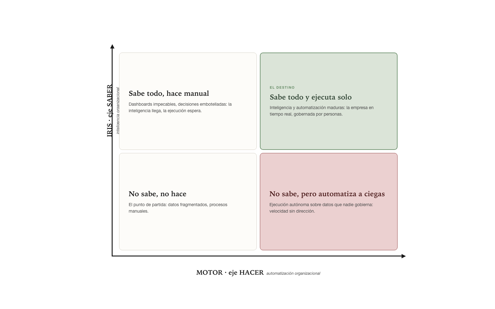
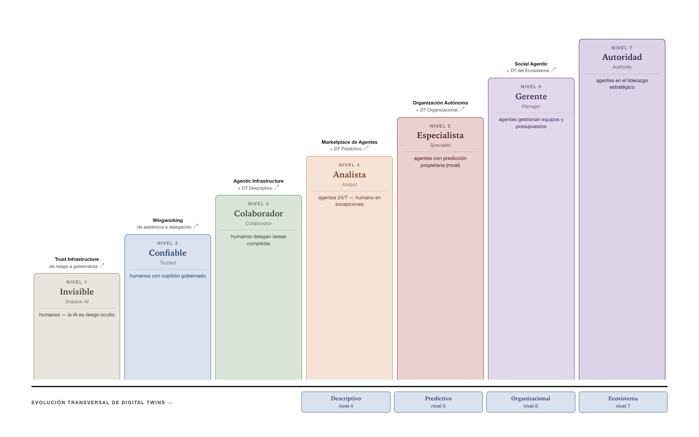

# MOTOR — Modelo de Madurez de Automatización Organizacional

*En la era de la IA agentiva*

<!-- standalone -->
> **Nota de versión.** v3 incorpora elementos rescatados del linaje histórico AOMM (*Autonomous Organization Maturity Model*, ultraBASE · Diciembre 2025) que no habían migrado a MOTOR v2: la imagen visual del modelo de madurez (sección "Estructura del Modelo", hoy rediseñada con la nomenclatura MOTOR) y dos términos del glosario (*Quick Win*, *Sweet Spot*). El cuerpo del modelo y su naturaleza diagnóstica permanecen intactos respecto a v2. AOMM v2 se conserva archivado como referencia de linaje.
<!-- /standalone -->
<!-- libro
Con el eje del SABER medido, el camino pide su simétrico: ¿quién ejecuta el trabajo? Este capítulo modela esa segunda trayectoria — la automatización organizacional — en siete niveles.
/libro -->

---

## Introducción · La Tesis

Las organizaciones están automatizando sus procesos mediante inteligencia artificial a velocidades sin precedentes. Pero "automatizar" no es un estado binario — es una trayectoria con estadios cualitativamente distintos. Una organización donde los empleados usan ChatGPT sin gobernanza no está en el mismo lugar que una donde agentes autónomos coordinan operaciones 24/7 con Digital Twins predictivos.

MOTOR mide esa trayectoria. Su pregunta fundamental es: **¿quién ejecuta el trabajo en tu organización — humanos, humanos asistidos, o agentes autónomos?**

El modelo describe 7 niveles de madurez que van desde el uso no gestionado de IA (Shadow AI) hasta organizaciones donde agentes tienen autoridad estratégica y operacional. El eje que mide es el **HACER** — el grado de automatización de los procesos organizacionales mediante IA.

### MOTOR e IRIS: el par diagnóstico de AURA

<!-- standalone -->
MOTOR es uno de dos modelos complementarios dentro de **AURA** (Arquitectura Unificada de Referencia Agentiva). Junto con **IRIS** (Modelo de Madurez de Inteligencia Organizacional), conforman el diagnóstico completo de la transformación organizacional:



**IRIS** mide qué tan bien fluye la información — desde datos fragmentados hasta un ecosistema de inteligencia auto-gestionado. **MOTOR** mide qué tan automatizados están los procesos — desde uso ad-hoc de IA hasta ejecución autónoma orquestada.

Son ortogonales: una organización puede estar alta en uno y baja en el otro. La madurez organizacional plena requiere avanzar en ambos ejes.
<!-- /standalone -->
<!-- libro
El par diagnóstico quedó presentado al abrir la Parte I: IRIS mide el SABER, MOTOR mide el HACER, son ortogonales, y la madurez plena exige avanzar en ambos. Aquí opera el segundo eje.
/libro -->

### Naturaleza diagnóstica

MOTOR es un modelo **diagnóstico**. Su propósito es evaluar en qué nivel se encuentra una organización y qué significa ese nivel. No prescribe qué implementar, cuánto invertir ni en qué plazo — eso ya no es diagnóstico: es la consultoría que se apoya en él.

<!-- standalone -->
Esta decisión de diseño es intencional: el estado del arte en IA evoluciona a velocidad sin precedente. Un modelo que prescriba tecnologías específicas queda obsoleto en meses. Un modelo que diagnostique estados de madurez permanece válido porque mide capacidades organizacionales, no herramientas.
<!-- /standalone -->
<!-- libro
La razón de diseño es la misma que sostiene a IRIS: se diagnostican capacidades organizacionales, no herramientas — y por eso el modelo no envejece con el estado del arte.
/libro -->

La prescripción específica — enablers de implementación, inversiones, timelines, ROI, proveedores y roadmaps — se desarrolla en el documento complementario *MOTOR in Practice* (ultraBASE, Febrero 2026).

---

<!-- pagebreak -->
## Estructura del Modelo

El modelo evalúa la madurez de automatización organizacional a través de **7 niveles** que representan estadios progresivos en el grado de autonomía de los procesos.



### Principios de diseño

**Foco en automatización de procesos, no en adopción de tecnología.** Cada nivel se define por quién ejecuta el trabajo y con qué grado de autonomía — no por qué herramientas de IA se usan. La tecnología es habilitadora, no el objeto de medición.

**Secuencialidad.** No se pueden saltar niveles. Cada nivel construye sobre los cimientos del anterior. Una organización que intenta operar en Nivel 4 sin haber resuelto la gobernanza del Nivel 2 generará riesgo, no valor.

**Coexistencia evolutiva.** Cada nivel subsume al anterior. Una organización en Nivel 4 no eliminó la colaboración humano-IA del Nivel 3 — la integró en un sistema más amplio donde los agentes operan autónomamente en los procesos que ya dominaban como colaboradores.

### Mapa de transiciones

Cada transición entre niveles tiene un nombre que funciona como señal diagnóstica — describe la capacidad que una organización necesita haber desarrollado para completar el salto:

```
  1 → 2    Trust Infrastructure         De riesgo a gobernanza
  2 → 3    Wingworking                 De asistencia a delegación
  3 → 4    Agentic Infrastructure       De delegación a autonomía
           + DT Descriptivo
  4 → 5    Marketplace de Agentes       De genérico a especializado
           + DT Predictivo
  5 → 6    Organización Autónoma        De capacidades a autoridad
           + DT Organizacional
  6 → 7    Social Agentic               De intra-org a ecosistema
           + DT del Ecosistema
```

Estos nombres no son prescripciones de implementación — son etiquetas diagnósticas que describen la naturaleza del cambio. Si una organización dice "estamos implementando Trust Infrastructure", un evaluador sabe que están en la transición 1→2.

---

## Nivel 1 · Invisible / Shadow AI
### La IA se usa sin gobernanza ni visibilidad organizacional

La organización tiene empleados usando herramientas de IA por cuenta propia — ChatGPT, Claude, GitHub Copilot, Midjourney — sin políticas, sin visibilidad y sin gobernanza. IT descubre el uso por facturas de tarjetas de crédito o por incidentes de seguridad. Cada empleado elige su propia herramienta (BYOA: Bring Your Own Agent).

Los procesos siguen siendo ejecutados por humanos. La IA existe como asistente personal no gestionado — aumenta la productividad individual pero no se captura organizacionalmente. El riesgo es alto: datos sensibles se exponen a clouds externos, decisiones se basan en outputs no validados, y no hay trazabilidad de qué se hizo con IA ni qué no.

**Características observables:**

- Nadie en la organización sabe qué herramientas de IA se usan ni por cuántas personas
- No hay políticas formales de uso de IA
- Empleados pagan suscripciones personales
- Datos sensibles (PII, financieros, estratégicos) se comparten con servicios externos sin control
- No hay trazabilidad de interacciones con IA
- Mejoras de productividad existen pero son invisibles y no replicables

**Riesgos diagnósticos:**

El Nivel 1 no es un punto de partida neutro — es un estado de riesgo activo. Las organizaciones en este nivel están expuestas a:

- **Exposición de datos sensibles.** PII (datos personales), PCI (datos de tarjetas), PHI (datos de salud) se comparten con servicios de IA externos sin control, tokenización ni trazabilidad.
- **Incumplimiento regulatorio.** GDPR, SOX, HIPAA, Ley de Contraloría, PCI-DSS — cualquier regulación que exija trazabilidad de cómo se procesan datos sensibles se viola potencialmente en cada interacción no gobernada con IA.
- **Pérdida de propiedad intelectual.** Código fuente, estrategias, análisis financieros, diseños — todo lo que los empleados comparten con servicios de IA públicos puede filtrarse o utilizarse para entrenar modelos.
- **Decisiones sin validación.** Outputs de IA se usan para tomar decisiones de negocio sin verificación, sin audit trail y sin responsabilidad clara.

**Ejemplos típicos:**

- Un desarrollador usa GitHub Copilot sin autorización, exponiendo código propietario a un servicio externo
- Un empleado resume emails confidenciales en ChatGPT público
- Un ejecutivo comparte un análisis estratégico con un chatbot para obtener feedback
- Un contador sube estados financieros a una IA pública sin controles de datos
- Un área de RRHH usa IA para filtrar CVs sin políticas de sesgo ni trazabilidad

**Pregunta diagnóstica:** *¿Saben cuántas herramientas de IA se usan en la organización, quién las usa, y qué datos se comparten con ellas?*

---

<!-- pagebreak -->
## Nivel 2 · Confiable / Trusted
### La IA está gobernada con políticas claras y herramientas aprobadas

La organización ha tomado control: existen herramientas oficiales aprobadas, políticas de uso documentadas, y mecanismos de confianza implementados (tokenización de datos sensibles, audit trails, anti-prompt injection). Los empleados tienen acceso a IA enterprise con SSO, permisos y trazabilidad.

Los procesos siguen siendo ejecutados por humanos, pero ahora con asistencia gobernada. La IA opera como copiloto: ayuda a redactar, resume, analiza — pero el humano mantiene el control completo del proceso. La diferencia con el nivel anterior no es tecnológica sino organizacional: hay gobernanza, hay confianza, hay visibilidad.

**Características observables:**

- Herramientas oficiales enterprise aprobadas y desplegadas (Microsoft 365 Copilot, Claude Enterprise, etc.)
- Políticas de uso aceptable documentadas y comunicadas
- Training completado por la mayoría de los empleados
- Audit trails de interacciones con IA
- Datos sensibles protegidos (tokenización, controles de acceso)
- El uso de IA es visible y auditable
- La IA asiste pero no ejecuta tareas completas

**Diferenciador crítico vs Nivel 1:**
- Nivel 1: Cero visibilidad, cero gobernanza, IA como riesgo individual no gestionado
- Nivel 2: Visibilidad completa, gobernanza activa, IA como herramienta organizacional controlada
- La diferencia no es la tecnología (puede ser la misma IA) — es la capa organizacional de control y confianza

**Ejemplos típicos:**

- Microsoft 365 Copilot desplegado enterprise-wide con gobernanza
- Claude Enterprise integrado con SSO corporativo y control de permisos
- Políticas documentadas de qué puede y qué no puede hacerse con IA
- Tokenización de datos sensibles antes de cualquier análisis con IA
- Training formal completado por 80%+ de los empleados

**Pregunta diagnóstica:** *¿Tienen herramientas de IA oficiales con gobernanza, audit trails y protección de datos sensibles implementadas?*

---

<!-- pagebreak -->
## Nivel 3 · Colaborador / Collaborator
### Los humanos delegan tareas completas a agentes de IA

El salto cualitativo: los humanos dejan de usar IA como asistente y comienzan a delegarle tareas completas end-to-end. El patrón que define este nivel es **Wingworking**.

### Wingworking

Wingworking es la metodología de colaboración humano-IA — desarrollada por el autor en la práctica de ultraBASE — donde el humano actúa como "piloto" — toma decisiones estratégicas, define objetivos y valida resultados — y el agente de IA opera como "wingman" — propone planes de ejecución, ejecuta tareas completas y reporta resultados. El nombre evoca la dinámica de un piloto y su wingman en aviación: confianza mutua, roles claros, comunicación estructurada.

```
  Wingworking Pattern:
  ─────────────────────────────────────────────
  1. Humano → Define objetivo y contexto
  2. Agente → Propone plan de ejecución detallado
  3. Humano → Aprueba plan o solicita ajustes
  4. Agente → Ejecuta plan completo
  5. Humano → Valida resultados
  ─────────────────────────────────────────────
  Resultado (caso típico): ~15 minutos de supervisión vs ~3 días de ejecución manual
```

Wingworking marca la transición de "usar IA" a "trabajar con IA". La diferencia es fundamental: en Nivel 2, el humano pide ayuda puntual ("resume este email"); en Nivel 3, el humano delega el resultado completo ("genera el reporte mensual de ventas, analiza desviaciones vs forecast, y envíalo al equipo").

Los agentes están integrados con sistemas empresariales (ERP, CRM, databases) mediante protocolos estandarizados. Pero operan con workflows pre-definidos: el proceso es determinístico y repetible. El agente no toma decisiones autónomas — ejecuta un plan aprobado.

**Características observables:**

- Delegación real de tareas completas (no solo asistencia puntual)
- Agentes integrados con sistemas empresariales
- Flujos colaborativos estructurados: humano define → agente propone → humano aprueba → agente ejecuta
- El humano valida resultados antes de ejecución final
- El agente sigue workflows pre-definidos, no decide autónomamente
- Reducción significativa de tiempo en tareas delegadas (de días a horas)
- Matrices de delegación: qué puede delegarse según nivel de riesgo

**Diferenciador crítico vs Nivel 2:**
- Nivel 2: IA asiste *dentro* de la tarea del humano — el humano ejecuta, la IA ayuda puntualmente
- Nivel 3: IA ejecuta *la tarea completa* — el humano define y valida, la IA produce el resultado end-to-end

**Diferenciador crítico vs Nivel 4:**
- Nivel 3: Workflow **pre-definido**, proceso repetible, sin modelo digital, humano aprueba cada plan
- Nivel 4: **Autonomía agentiva** con Digital Twin Descriptivo, decisiones dinámicas sin aprobación humana

**Ejemplos típicos:**

- "Genera reporte mensual de ventas completo y envía al equipo" — el agente extrae datos del CRM, compara vs forecast, identifica top/bottom 5 productos, analiza causas, genera presentación
- "Procesa expediente de permiso de construcción" — el agente ejecuta 47 validaciones, genera ficha técnica, prepara resolución (3 días vs 15 días manual)
- "Analiza propuestas de presupuesto participativo y genera fichas técnicas" — el agente procesa propuestas ciudadanas, evalúa factibilidad, genera fichas estandarizadas (3 días vs 6 semanas)
- "Escribe módulo de autenticación siguiendo nuestros estándares" — el agente propone arquitectura, implementa, ejecuta tests, documenta

**Pregunta diagnóstica:** *¿Los empleados delegan tareas completas a agentes de IA — definiendo el objetivo y recibiendo el resultado — en lugar de solo pedir asistencia puntual?*

---

<!-- pagebreak -->
## Nivel 4 · Analista / Analyst
### Agentes operan autónomamente 24/7 con coordinación multi-agente

Múltiples agentes auto-coordinados operan continuamente sin intervención humana. El humano interviene solo en excepciones — más del 95% de las decisiones operativas las toman los agentes dentro de reglas definidas. La organización tiene un **Digital Twin Descriptivo**: un modelo digital sincronizado en tiempo real que los agentes consultan como fuente de verdad.

La diferencia con el nivel anterior es fundamental: en Nivel 3, el humano aprueba cada plan; en Nivel 4, los agentes deciden y ejecutan autónomamente basándose en reglas inteligentes y análisis de datos del Digital Twin. No predicen ni simulan — reaccionan inteligentemente al estado actual.

**Características observables:**

- Agentes operando 24/7 sin supervisión constante
- Coordinación multi-agente: agentes se comunican entre sí
- Digital Twin Descriptivo de infraestructura/operaciones (estado actual + históricos)
- Humano interviene solo en excepciones (>95% autonomía operativa)
- Decisiones basadas en reglas inteligentes + análisis, no en simulación
- Time-to-insight: de semanas a segundos
- Shared context: agentes comparten estado y decisiones
- Sin capacidad predictiva (eso es Nivel 5)

**Diferenciador crítico vs Nivel 3:**
- Nivel 3: IA ejecuta **tareas** con workflow fijo, sin modelo digital, humano aprueba cada plan
- Nivel 4: IA toma **decisiones** autónomas usando DT Descriptivo como base, opera 24/7

**Diferenciador crítico vs Nivel 5:**
- Nivel 4: Decisiones basadas en reglas + análisis del estado actual, **sin simulación**
- Nivel 5: Agentes especialistas **con capacidad predictiva/simulación**, generan ventaja competitiva sostenible

**Ejemplos típicos:**

**Dashboard ejecutivo generado conversacionalmente en 30 segundos:**
```
  Humano: "Dame dashboard de obras en sector norte, último trimestre"
  Agente Analista: Accede a DT Descriptivo
                   → Extrae data de proyectos, contratistas, avance
                   → Genera visualizaciones automáticas
                   → Produce insights basados en históricos
  Resultado: Dashboard completo en 30 segundos vs 2 semanas manual
```

**Balanceo de carga autónomo (Telecom):**
```
  Estado DT Descriptivo:
  - Celda X: 87% carga
  - Celda Y: 62% carga
  - Celda Z: 58% carga

  Agente (sin simulación):
  → Regla inteligente: "Si X >85% Y vecinas <70%, redistribuir"
  → Análisis histórico: "A esta hora, redistribución funciona 92% veces"
  → Ejecuta: Redistribuye 30% X→Y, 20% X→Z
  → Monitorea DT: Si falla, revierte automáticamente

  NO simula escenarios, solo decide inteligentemente basado en DT + reglas
```

**Respuesta autónoma a emergencia climática (Municipalidad):**
```
  Agente Monitor Clima → Lee DT → Lluvia intensa detectada
  Agente Monitor → Agente Riesgo: "Lluvia intensa sector norte"
  Agente Riesgo → Lee DT históricos → Calcula probabilidad
  Agente Riesgo → Agente Emergencias: "Probabilidad inundación 85%"
  Agente Emergencias → Agente Comunicaciones: "Enviar 12K SMS"
  Agente Emergencias → Agente Tránsito: "Cerrar 6 rutas"

  7 agentes coordinados, todo en 13 minutos, sin intervención humana
  Leyendo/actualizando DT Descriptivo continuamente
```

**Pregunta diagnóstica:** *¿Tienen agentes operando 24/7 coordinados entre sí, consultando un modelo digital del sistema, con intervención humana solo en excepciones?*

---

<!-- pagebreak -->
## Nivel 5 · Especialista / Specialist
### Agentes con capacidades predictivas propietarias generan ventaja competitiva

Los agentes no solo reaccionan al presente — anticipan el futuro. La organización tiene un **Digital Twin Predictivo/Prescriptivo**: modelos entrenados con datos propietarios (5-10 años) que permiten predecir eventos y simular escenarios. Esta capacidad genera ventaja competitiva sostenible (moat) porque los competidores necesitan años para replicar los datos.

La diferencia con el nivel anterior: en Nivel 4, un agente reacciona cuando un evento ocurre (basándose en reglas). En Nivel 5, un agente predice el evento 18 horas antes y prepara la respuesta óptima simulando múltiples escenarios.

**Características observables:**

- Agentes especialistas con modelos predictivos propietarios
- Digital Twin Predictivo/Prescriptivo (simulación de escenarios)
- Datos históricos propietarios curados (5-10 años)
- Capacidad de simulación: "¿qué pasa si...?"
- Optimización de decisiones antes de ejecutar
- Ventaja competitiva verificable (competencia no puede replicar)
- La predicción diferencia a la organización en su mercado

**Diferenciador crítico vs Nivel 4:**
- Nivel 4: Agente REACCIONA cuando evento ocurre (tarde, basado en reglas)
- Nivel 5: Agente PREDICE y PREPARA antes de que ocurra (simulación de escenarios)

**Señal diagnóstica: Build vs Rent.** Una organización puede llegar a Nivel 5 de dos maneras: construyendo su propio DT Predictivo con datos propietarios (requiere años de datos y expertise), o accediendo a agentes especialistas del mercado que ya tienen esa capacidad. Ambos caminos son válidos — la señal diagnóstica no es cómo llegó, sino si tiene la capacidad predictiva operando.

**Ejemplo típico (Telecomunicaciones):**
```
  Agente Especialista de Optimización de Eventos Masivos:

  Contexto: Concierto 50K personas en estadio mañana

  Digital Twin Predictivo propietario:
  → Modelo entrenado con 8 años de eventos en ESE estadio
  → PREDICE curva de demanda exacta:
     - 73% usuarios llega 2h antes (patrón local único)
     - Pico tráfico data 4.2x normal
     - Duración: 30min pre + 45min post

  Digital Twin Prescriptivo (simulación):
  → SIMULA 5 configuraciones de red:
     Escenario A: COWs (celdas móviles) en posición X,Y → 12% degradación
     Escenario B: COWs en posición W,Z → 3% degradación
     Escenario C: COWs + ajuste potencia → 0.8% degradación

  Decisión optimizada:
  → EJECUTA Escenario C (mejor en simulación)
  → Pre-posiciona recursos 18 horas antes

  Resultado: 0% degradación vs competencia con 40% llamadas caídas
```

**Ejemplo típico (Municipalidad):**
```
  Simulador de Políticas Públicas con Digital Twin:

  DT con 20 años datos demográficos, económicos, urbanos
  Simula: "¿Qué pasa si subo impuesto territorial 5%?"
  Predice: Recaudación, migración, impacto comercio local

  La capacidad de simular antes de implementar
  transforma decisiones de política pública de "apuestas" en "experimentos"
```

**Pregunta diagnóstica:** *¿Tienen agentes especialistas con capacidad de predecir eventos y simular escenarios usando datos propietarios que la competencia no puede replicar?*

---

<!-- pagebreak -->
## Nivel 6 · Gerente / Manager
### Agentes gestionan equipos, presupuestos y recursos con autoridad organizacional

Los agentes no solo operan procesos — gestionan la organización. Tienen autoridad para asignar trabajo a humanos, optimizar presupuestos, evaluar desempeño, y tomar decisiones de gestión. La organización tiene un **Digital Twin Organizacional**: un modelo completo que incluye personas, finanzas, operaciones e interdependencias — no solo infraestructura técnica.

Los agentes simulan decisiones de gestión antes de ejecutarlas: "¿reasigno 50 técnicos de norte a sur?" se evalúa en el Digital Twin con todos los impactos en SLAs, costos, satisfacción. La diferencia con el nivel anterior: de DT de dominio técnico a DT de toda la organización.

**Características observables:**

- Agentes con autoridad para asignar trabajo a humanos
- Digital Twin Organizacional (personas + finanzas + operaciones + interdependencias)
- Simulación de decisiones de gestión antes de ejecutar
- Humanos reportan a agentes en dominios específicos
- Presupuestos gestionados o co-gestionados por agentes
- Métricas objetivas automatizadas para evaluación de desempeño
- Cultura organizacional adaptada: humanos aceptan autoridad de agente en dominios definidos

**Diferenciador crítico vs Nivel 5:**
- Nivel 5: DT de dominio **técnico** especializado (red, infraestructura, operaciones)
- Nivel 6: DT de **TODA la organización** (técnico + humano + financiero + interdependencias)
- Nivel 5: Agentes con capacidades propietarias de predicción
- Nivel 6: Agentes con **autoridad organizacional** — gestionan personas y presupuestos

**Ejemplo típico (Telecomunicaciones):**
```
  Agente Gerente de Operaciones Regionales:

  Decisión: ¿Reasignar 50 técnicos de Región Norte a Sur?

  Digital Twin Organizacional completo:
  → Modela: 5,000 técnicos, 12 regiones, SLAs, costos, satisfacción

  Simulación en DT:
  Escenario A: Reasignar 50
     - Norte: SLA baja 98%→92% (riesgo)
     - Sur: SLA sube 88%→95% (crítico)
     - Costo: $45K

  Escenario B: Reasignar 30
     - Norte: SLA baja 98%→95% (aceptable)
     - Sur: SLA sube 88%→93% (bien)
     - Costo: $28K

  Escenario C: Reasignar 30 + contratar 15 temporal Sur
     - Ambas regiones >95% SLA
     - Costo: $52K

  Decisión optimizada (basada en simulación): Escenario C
```

**Ejemplo típico (Municipalidad):**
```
  Agente Gerente de Finanzas Municipales:

  DT modela: presupuesto completo, 32 centros de costo, proyecciones
  Simula reasignación de recursos entre departamentos
  Predice impacto en ejecución, servicios, satisfacción ciudadana
  Ejecuta decisión optimizada — no es una "apuesta" sino un resultado simulado
```

**Pregunta diagnóstica:** *¿Tienen agentes con autoridad para asignar trabajo, gestionar presupuestos o tomar decisiones de gestión respaldadas por un modelo digital de toda la organización?*

---

<!-- pagebreak -->
## Nivel 7 · Autoridad / Authority
### Agentes como socios estratégicos con visión del ecosistema completo

Los agentes participan en decisiones estratégicas. La organización tiene un **Digital Twin del Ecosistema**: un modelo que incluye no solo la organización sino también competidores, reguladores, proveedores, mercado y fuerzas externas. Los agentes simulan futuros a 5-10 años, detectan oportunidades estratégicas, evalúan fusiones y adquisiciones, y proponen nuevos negocios.

Los agentes tienen identidad digital verificable — un track record inmutable de logros y decisiones. Pueden ser "contratados" por otras organizaciones para proyectos específicos. La frontera entre organizaciones se difumina a medida que los agentes colaboran en redes inter-organizacionales.

**Características observables:**

- Digital Twin del Ecosistema (organización + competencia + mercado + entorno)
- Simulación de escenarios estratégicos a 5-10 años
- Agentes proponen nuevos productos/servicios con business case
- El board considera recomendaciones de agentes regularmente
- Agentes con identidad digital verificable y reputación
- Redes inter-organizacionales de agentes
- Detección de oportunidades estratégicas y prevención de riesgos

**Diferenciador crítico vs Nivel 6:**
- Nivel 6: DT de **TU organización** (intra-org, control alto, horizonte 6-24 meses)
- Nivel 7: DT del **ECOSISTEMA** (inter-org, control bajo, horizonte 5-10 años)
- Nivel 6: Agente optimiza la organización existente
- Nivel 7: Agente propone cambiar el juego — nuevos mercados, M&A, pivots estratégicos

**Ejemplo típico (Telecomunicaciones):**
```
  Agente Estratégico detecta oportunidad:

  Digital Twin del Ecosistema Telecom:
  → Modela: Tu telco + 3 competidores + disruptores
     (Starlink, Apple eSIM, Google Fi) + regulador + 18M suscriptores

  Tendencias externas:
  → 6G en 2030, satelital LEO democratizado
  → Work from home permanente, digital nomads emergentes

  Simulación: "¿Qué pasa si Starlink captura 15% mercado rural en 3 años?"

  Escenario A (Defensivo): Reducir precio rural para competir
     → Resultado: -$45M revenue, mantener 80% share rural
  Escenario B (Ofensivo): Abandonar rural, focus urbano premium
     → Resultado: -$30M revenue rural, +$80M urban premium
  Escenario C (Asociativo): Partnership con Starlink (wholesale rural)
     → Resultado: -$15M margin rural, +$20M nuevos servicios

  Recomendación a Board: Escenario B + hedge con C
```

**Ejemplo típico (Municipalidad):**
```
  Red Nacional de Agentes Municipales:

  Digital Twin del Ecosistema Municipal Nacional:
  → Modela: 345 municipalidades con sus capacidades
  → Gobierno central (SUBDERE, SENAPRED)
  → Recursos compartibles (ambulancias, equipos, personal)
  → Patrones de emergencias (histórico 20 años)

  Simulación de coordinación ante catástrofe:
  → Terremoto 7.8 zona centro
  → DT simula respuesta coordinada 345 municipios
  → Optimiza compartición de recursos automáticamente
```

**Pregunta diagnóstica:** *¿Tienen agentes que participan en decisiones estratégicas con un modelo digital del ecosistema completo — competencia, mercado, regulación — y simulación de futuros a largo plazo?*

---

## Digital Twins como Dimensión Diagnóstica

Los Digital Twins emergen como indicador transversal de madurez que evoluciona progresivamente. Su presencia y sofisticación son una señal diagnóstica potente del nivel de automatización.

```
  Nivel    Tipo de Digital Twin              Alcance
  ───────────────────────────────────────────────────────────────
  1–3      No existe                         N/A
  4        Descriptivo                       Infraestructura/operaciones
  5        Predictivo/Prescriptivo           Dominio técnico especializado
  6        Organizacional                    Toda la organización
  7        Estratégico del Ecosistema        Org + competencia + mercado
```

### DT Descriptivo (Nivel 4)
Modelo digital sincronizado en tiempo real. Responde: ¿qué tengo? ¿cuál es el estado actual? ¿qué pasó? Monitoreo, correlación, detección de anomalías. No predice ni simula.

### DT Predictivo/Prescriptivo (Nivel 5)
Extensión del descriptivo con capacidad de anticipar y simular. Responde: ¿qué va a pasar? ¿qué pasa si hago X? ¿cuál es la mejor acción? Requiere datos propietarios (5-10 años) y genera ventaja competitiva sostenible.

### DT Organizacional (Nivel 6)
Modelo de toda la organización: personas, finanzas, operaciones, interdependencias. Responde: ¿cómo optimizo asignación de recursos? ¿qué impacto tiene esta decisión en toda la org?

### DT del Ecosistema (Nivel 7)
Modelo del ecosistema completo: competidores, reguladores, mercado, fuerzas macro. Responde: ¿qué oportunidades estratégicas existen? ¿qué pasa si el competidor X hace Y?

### Diferencias por industria

La construcción de Digital Twins varía radicalmente según la madurez de los sistemas existentes. Esto tiene implicaciones diagnósticas importantes:

**Industrias con sistemas maduros (Telecom, Energía, Manufactura):**
- Nivel 4 puede construirse *sobre* sistemas existentes. En telecomunicaciones, el OSS (Operation Support Systems) ya es esencialmente un DT Descriptivo — la inversión es agregar la capa de agentes, no construir el modelo desde cero.
- Nivel 5 se alimenta de décadas de datos operacionales ya curados.
- El diagnóstico debe evaluar: ¿qué sistemas legacy pueden convertirse en DT?

**Industrias emergentes (Smart Cities, Retail, Servicios):**
- Nivel 4 requiere construir el DT desde cero. No existe un "OSS municipal" maduro.
- La inversión y complejidad son significativamente mayores.
- La oportunidad: diseñar desde cero sin deuda técnica.
- El diagnóstico debe evaluar: ¿qué infraestructura de datos existe como base?

**Ejemplo concreto:**
```
  Telecom llegando a Nivel 4:
  → OSS ya existe como DT Descriptivo
  → Agregar capa de agentes sobre la base existente
  → Datos de 10+ años disponibles

  Smart City llegando a Nivel 4:
  → Hay que construir DT de infraestructura urbana completo
  → Integrar sensores IoT, sistemas municipales, datos históricos
  → Los datos pueden no existir o estar fragmentados
```

---

## Dimensiones de Evaluación por Nivel

| Dimensión | 1. Invisible | 2. Confiable | 3. Colaborador | 4. Analista | 5. Especialista | 6. Gerente | 7. Autoridad |
|---|---|---|---|---|---|---|---|
| **Infraestructura & Agentes** | BYOA, sin control | Enterprise con gobernanza | Integración con sistemas | Multi-agente coordinado + DT Descriptivo | Agentes especialistas + DT Predictivo | DT Organizacional | DT del Ecosistema |
| **Autonomía Operacional** | IA como riesgo | IA como copiloto | Delegación de tareas | Autopilot 24/7 (>95%) | Autonomía predictiva | Autoridad de gestión | Autoridad estratégica |
| **Personas & Cultura** | Usuarios individuales | Usuarios gobernados | Delegadores de tareas | Supervisores de excepciones | Diseñadores de especialización | Reportan a agentes | Co-liderazgo con agentes |
| **Gobernanza** | Sin gobernanza | Políticas + audit trails | Matrices de delegación | Protocolos multi-agente | Gobernanza de predicción | Gobernanza de autoridad org. | Gobernanza de ecosistema |
| **Digital Twins** | N/A | N/A | N/A | Descriptivo | Predictivo/Prescriptivo | Organizacional | Ecosistema |
| **Valor de Negocio** | Productividad individual no capturada | Reducción de riesgo, eficiencia básica | Reducción de tiempo en tareas | Operación continua, eficiencia sistémica | Ventaja competitiva (moat) | Optimización organizacional | Oportunidades estratégicas |

---

## Distribución del Mercado

**Estado actual (2025):**
- ~70% en Nivel 1 (Invisible / Shadow AI)
- ~25% en Nivel 2 (Confiable / Trusted)
- ~4% en Nivel 3 (Colaborador / Collaborator)
- <1% en Nivel 4+ (Analista+ / Analyst+)

**Proyección 2030:**
- ~10% en Nivel 1-2 (rezagados)
- ~30% en Nivel 3 (Colaborador)
- ~50% en Nivel 4 (Analista) ← Nuevo estándar competitivo
- ~10% en Nivel 5+ (líderes de industria; dentro de este grupo, <0.1% en Nivel 7, experimental)

Nivel 4 (Analista) será el nuevo baseline del mercado para 2030 — el mínimo para competir. La velocidad de llegada determina la ventaja competitiva. Nivel 5 (Especialista) será el diferenciador sostenible para quienes tengan datos propietarios y capacidad de inversión.

Estas estimaciones son referenciales y basadas en la observación del mercado al momento de publicación.

---

## Assessment Rápido

**8 preguntas para ubicar tu nivel:**

1. **¿Tienen inventario completo de herramientas de IA usadas?**
   No → Nivel 1 · Sí, con gobernanza → Nivel 2+

2. **¿Tienen políticas formales de uso de IA con enforcement activo?**
   No → Nivel 1 · Sí → Nivel 2+

3. **¿Trust Infrastructure implementada (tokenización, audit trails)?**
   No → Nivel 1 · Sí → Nivel 2+

4. **¿Delegan tareas completas end-to-end a agentes?**
   No → Nivel 2 · Sí, con workflow fijo → Nivel 3 · Sí, con autonomía → Nivel 4+

5. **¿Tienen Digital Twin Descriptivo de infraestructura/operaciones?**
   No → Nivel 3 o inferior · Sí, completo y en tiempo real → Nivel 4+

6. **¿Agentes operan 24/7 con coordinación multi-agente?**
   No → Nivel 3 o inferior · Sí → Nivel 4+

7. **¿Agentes especialistas con capacidad predictiva/simulación?**
   No → Nivel 4 o inferior · Sí, con DT Predictivo → Nivel 5+

8. **¿Digital Twin Organizacional o del Ecosistema?**
   No → Nivel 5 o inferior · DT Organizacional → Nivel 6 · DT del Ecosistema → Nivel 7

---

## ¿Cómo usar este modelo?

**Para diagnóstico:** Identifica el nivel que mejor describe el estado actual de la organización en cada dimensión. Una organización puede estar en niveles diferentes según la dimensión — por ejemplo, en Nivel 3 en Autonomía Operacional pero en Nivel 1 en Gobernanza. El nivel general se determina por la dimensión más baja, ya que representa el cuello de botella real.

**Para planificación:** El modelo permite identificar brechas y priorizar. Si la organización está en Nivel 3 en operaciones pero en Nivel 1 en gobernanza, la gobernanza es el cuello de botella — no importa cuánta automatización se implemente si no hay gobernanza para sostenerla. La prescripción específica de qué implementar y en qué orden pertenece al trabajo de consultoría que parte de este diagnóstico (ver *MOTOR in Practice*).

**Para comunicación ejecutiva:** Los 7 niveles ofrecen un vocabulario común. "Estamos en Nivel 2, avanzando hacia Nivel 3" es una frase que un board entiende y que permite tomar decisiones estratégicas sobre inversión y prioridad.

**En conjunto con IRIS:** El diagnóstico completo de la transformación organizacional requiere ambos modelos. IRIS evalúa el eje SABER (inteligencia organizacional). MOTOR evalúa el eje HACER (automatización de procesos). Una organización con IRIS alto y MOTOR bajo sabe todo pero hace poco. Una con MOTOR alto e IRIS bajo automatiza a ciegas. El cuadrante superior derecho — alta inteligencia, alta automatización — es el destino.

---

## Vista Rápida: Los 7 Niveles

*Tabla de consulta rápida; el detalle de cada nivel vive en su sección.*

| # | Nombre | Una frase | Quién ejecuta | Transición siguiente |
|---|---|---|---|---|
| 1 | Invisible | IA sin gobernanza ni visibilidad | Humanos (IA es riesgo oculto) | → Trust Infrastructure |
| 2 | Confiable | IA gobernada como copiloto | Humanos con asistencia controlada | → Wingworking |
| 3 | Colaborador | Delegación de tareas completas | Humanos delegan, agentes ejecutan bajo aprobación | → Agentic Infra + DT Descriptivo |
| 4 | Analista | Operación autónoma 24/7 con DT Descriptivo | Agentes (humano solo en excepciones) | → Marketplace + DT Predictivo |
| 5 | Especialista | Capacidades predictivas propietarias (moat) | Agentes especialistas con simulación | → Org Autónoma + DT Organizacional |
| 6 | Gerente | Autoridad organizacional con DT completo | Agentes gestionan humanos y recursos | → Social Agentic + DT Ecosistema |
| 7 | Autoridad | Socio estratégico con visión del ecosistema | Agentes en liderazgo y redes inter-org | — |

---

## Glosario

**Agentic Infrastructure.** Conjunto de protocolos y servicios que permiten a múltiples agentes de IA comunicarse, coordinarse y ejecutar tareas autónomamente. Señal diagnóstica de la transición 3→4.

**Autopilot.** Modo de operación donde agentes ejecutan tareas de forma autónoma 24/7 sin supervisión humana en tiempo real, con intervención solo en excepciones. Característica definitoria del Nivel 4.

**BYOA (Bring Your Own Agent).** Patrón observable del Nivel 1 donde cada empleado elige y usa su propia herramienta de IA sin coordinación organizacional.

**Digital Twin (Gemelo Digital).** Modelo digital sincronizado de un sistema, organización o ecosistema. Enabler transversal que evoluciona desde Descriptivo (Nivel 4) hasta Estratégico del Ecosistema (Nivel 7).

**DT Descriptivo.** Digital Twin sincronizado en tiempo real que monitorea estado actual e históricos sin capacidad predictiva. Señal diagnóstica del Nivel 4.

**DT Predictivo/Prescriptivo.** Digital Twin con capacidad de predecir eventos y simular escenarios. Requiere datos propietarios (5-10 años). Señal diagnóstica del Nivel 5 y fuente de moat.

**DT Organizacional.** Digital Twin que modela toda la organización (personas, finanzas, operaciones, interdependencias). Señal diagnóstica del Nivel 6.

**DT del Ecosistema.** Digital Twin que modela el ecosistema completo (competencia, reguladores, mercado, fuerzas externas). Señal diagnóstica del Nivel 7.

**Moat (Ventaja Competitiva Sostenible).** Capacidad propietaria difícil de replicar. En MOTOR, emerge en Nivel 5 cuando los datos propietarios (5-10 años) alimentan agentes especialistas con capacidad predictiva.

**Organización Autónoma.** Modelo organizacional donde agentes gestionan procesos y personas basándose en métricas objetivas y simulaciones del DT Organizacional. Señal diagnóstica de la transición 5→6.

**Quick Win.** Caso de uso de IA con alta visibilidad, baja complejidad técnica y ROI rápido (típicamente menor a seis meses), seleccionado para generar momentum y validar capacidad antes de inversiones mayores. Concepto operativo aplicable a cualquier nivel de MOTOR, particularmente útil en transiciones tempranas (1→2, 2→3) donde la organización necesita evidencia visible de retorno antes de comprometer presupuestos mayores.

**Shadow AI.** Uso no gestionado de herramientas de IA sin gobernanza, compliance ni visibilidad organizacional. Estado definitorio del Nivel 1.

**Social Agentic.** Ecosistema donde agentes de diferentes organizaciones colaboran con identidades digitales verificables. Señal diagnóstica de la transición 6→7.

**Marketplace de Agentes.** Ecosistema donde capacidades de agentes se adquieren, comparten o comercializan entre organizaciones. Señal diagnóstica de la transición 4→5: la organización deja de construir toda capacidad internamente y empieza a componer con capacidades especializadas del mercado.

**Sweet Spot.** Nivel de madurez donde se maximiza el balance entre retorno, riesgo e inversión. En MOTOR, el Sweet Spot está en Nivel 4 (Analyst): es el punto donde la organización captura la mayor parte del valor económico de la autonomía operacional sin asumir el costo y la complejidad de Niveles 5-7. Para 2030, el Nivel 4 será el nuevo baseline competitivo del mercado.

**Trust Infrastructure.** Conjunto de tecnologías (tokenización, anti-prompt injection, audit trails, compliance automático) que permiten usar IA de forma gobernada y auditable. Señal diagnóstica de la transición 1→2. Es la misma primitiva que *AgencyDomains* especifica formalmente en su canon; aquí se usa como umbral de madurez, no como spec.

**Wingworking.** Metodología de colaboración humano-IA donde el humano actúa como "piloto" (decisiones estratégicas, validación) y la IA como "wingman" (ejecución táctica delegada). Práctica original de ultraBASE. Señal diagnóstica de la transición 2→3 y característica definitoria del Nivel 3.

---

## Referencia Cruzada

MOTOR es el instrumento de medición del eje HACER — la automatización organizacional mediante IA. Junto con **IRIS** (Modelo de Madurez de Inteligencia Organizacional), conforma el par diagnóstico de **AURA** — la arquitectura empresarial agentiva de ultraBASE.

La prescripción específica de enablers, inversiones, timelines, ROI y roadmaps se desarrolla en el documento complementario: *MOTOR in Practice — Guía de Implementación* (ultraBASE, Febrero 2026).

<!-- standalone -->
La visión fundacional de la arquitectura se encuentra en: *Visión de AURA — Arquitectura Unificada de Referencia Agentiva* (ultraBASE, Febrero 2026).
<!-- /standalone -->
<!-- libro
La visión fundacional de la arquitectura es la Introducción de este libro.
/libro -->

